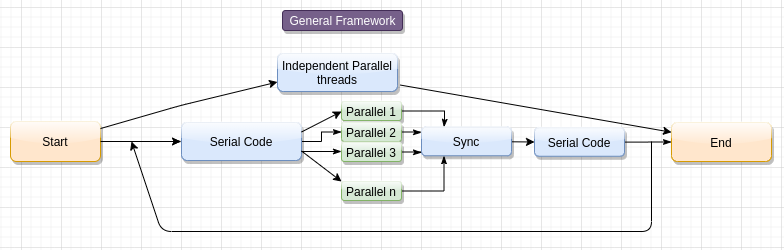

# Distributed-Game-Framework

Distributing computation of different game elements in separate machines to remove computation load from the game rendering machine. 
All game element computations are done in the server in a distributed manner. Client machines connect to server to begin game, and then communicate with 
Kafka servers to get game element informations.

# Getting started

Distributed-Game-Framework requires Go >= 1.14 and a running Kafka  >= 2.12 server.

## Install Go Dependencies - 

* `go get -v -d -x github.com/veandco/go-sdl2/{sdl,img,mix,ttf}`  
* `go get -v -d -x github.com/segmentio/kafka-go`

## Running for development -

1. Start kafka server prefereable on port `9092`.
2. Start server - `go run server.go --kafkaAddress localhost:9092`
3. In a new terminal start first client - `go run client.go --clientAddress 127.0.0.1:5000`
4. In another new terminal start second client - `go run client.go --clientAddress 127.0.0.1:5001`
5. Game starts once bootstrap is completed (5-7 seconds).

# Writing your own game

## Server Code

### 1. Reading Client Requests

Separate threads on the server handle requests made by each client and update the state of the client maintained by the server. This part can generally be implemented as part of the **Independent Parallel Threads**.

### 2. Processing Client Requests

Since the complete code might not be parallelizable, this may be a chain of serial and parallel sections of the code. A synchronization point may (not) be required.

Being slow, we recommend writing to clients in the Parallel sections only.

## Client Code

### 1. Reading Server Response and Other Player Requests

Similar to **Reading Client Requests**, this section shall be implemented as **Independent Parallel Threads** and update the state variables maintained by the client.

### 2. Reading user's input and sending to the Server

Being a continuous process, this must run continuously as part of **Independent Parallel Threads**.

### 3. Updating GUI

Most libraries do not support non-main threads to update the GUI and may throw Segmentation Fault. Therefore, GUI updates must be done serially in the main thread. Locks and synchronization points are used to maintain the required level of consistency.

# The Pong Game

## Server Code

*Read from Kafka and Update Player X position*, where X denotes the player number, are parts of independent parallel threads. The processing of collision of each ball with the player pedals, and writing the new ball position and velocity is processed in parallel threads **ball Y**, where Y denotes the ball number. To incorporate the conditions where synchronization point is required, we include Ball-to-Ball collision. This is a serial code that runs after the collision of each ball with the pedals has been processed. The synchronization is implemented using [Go WaitGroup](https://golang.org/pkg/sync/#WaitGroup). When a ball leaves the bounds of the playing area, the thread sends a message to the client and causes the process to exit.

## Client Code

All reads and writes are implemented as separate threads. The Update GUI section is done in the main thread as an infinite loop. Whenever the **Game Over** message is received, the process exits.
